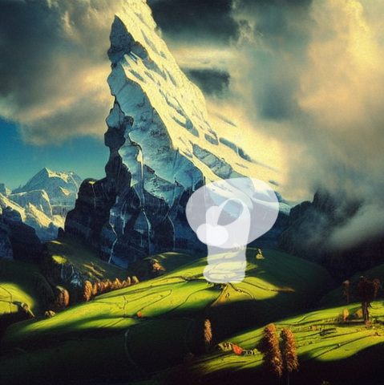
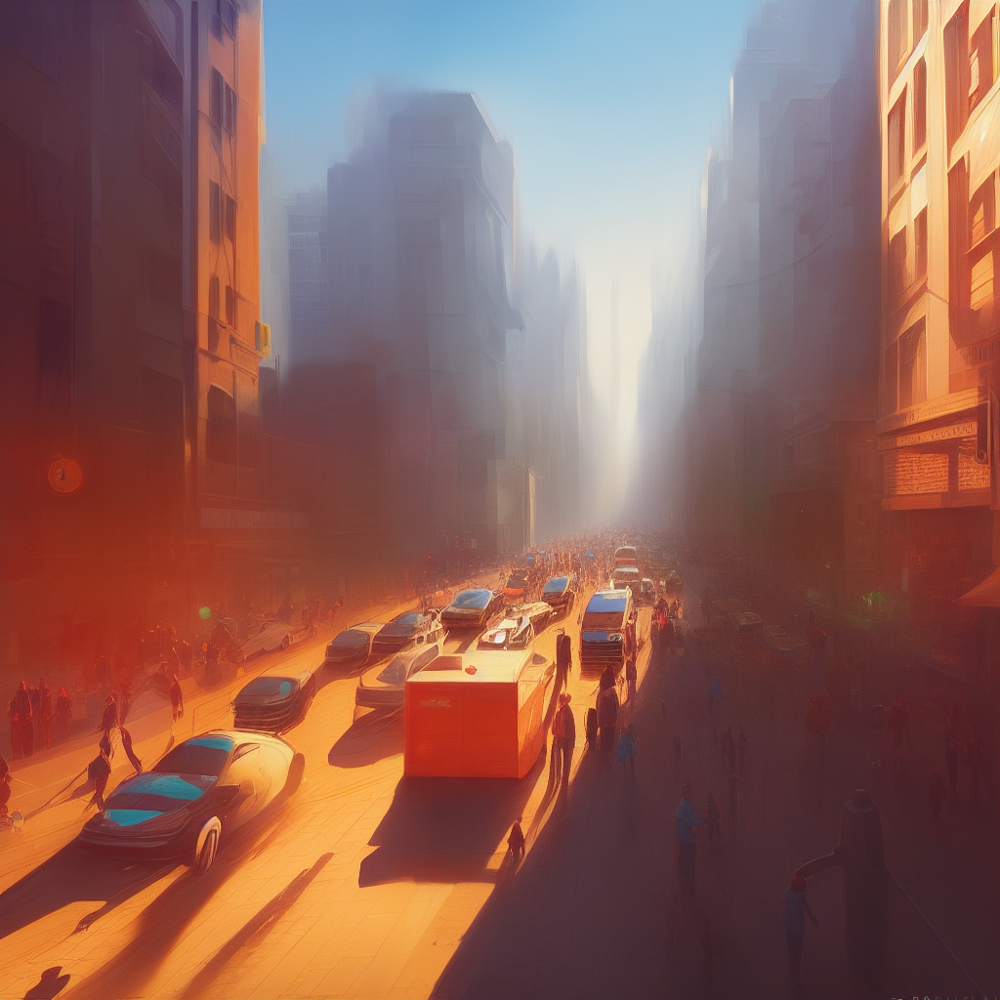
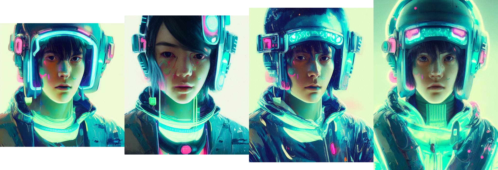

This is a feature showcase page for Stable Diffusion web UI.

这是 Stable Diffusion Web UI 的功能展示页面。

All examples are non-cherrypicked unless specified otherwise.

除非另有说明，否则所有示例都不是精挑细选的。

# SD2 Variation Models(变异模型)
[PR](https://github.com/AUTOMATIC1111/stable-diffusion-webui/pull/8958), ([more info](https://github.com/Stability-AI/stablediffusion/blob/main/doc/UNCLIP.MD))

支持用于生成图像变化的[stable-diffusion-2-1-unclip](https://huggingface.co/stabilityai/stable-diffusion-2-1-unclip) 检查点. 

它的工作方式与当前支持的 SD2.0 深度模型相同，您可以从 img2img 选项卡中运行它，它会从输入图像（在本例中为 CLIP 或 OpenCLIP 嵌入）中提取信息，并将这些信息输入模型中，除了文本prompts之外。通常情况下，您应该将去噪强度设置为1.0，因为您实际上不希望正常的 img2img 行为对生成的图像产生任何影响。


# InstructPix2Pix
[Website](https://www.timothybrooks.com/instruct-pix2pix). [Checkpoint](http://instruct-pix2pix.eecs.berkeley.edu/instruct-pix2pix-00-22000.ckpt). 该检查点在 img2img 选项卡中得到了完全支持。无需额外操作。以前需要由贡献者开发的 扩展程序 来生成图像，现在不再需要了，但应该仍然可以工作。大多数 img2img 实现都是由同一人完成的。

要重现原始 repo 的结果，请使用 1.0 的降噪，欧拉采样器，并编辑 configs/instruct-pix2pix.yaml 中的配置以说明：

```
    use_ema: true
    load_ema: true
```

instead of:

```
    use_ema: false
```


# Extra networks
一个带有卡片图片的单个按钮。它将多个扩展生成方式整合到一个用户界面中。

在大的生成按钮旁边找到它：


额外网络提供了一组卡片，每个卡片对应一个包含你训练或从其他地方获取的模型部分的文件。单击卡片将其添加到prompts中，它将影响生成。

| Extra network     | Directory     | File types                        | How to use in prompt     |
|-------------------|---------------|-----------------------------------|--------------------------|
| Textual Inversion | `embeddings`  | `*.pt`, images                    | embedding's filename     |
| LoRA              | `models/Lora` | `*.pt`, `*.safetensors`           | `<lora:filename:multiplier>` |
| Hypernetworks     | `models/hypernetworks`     | `*.pt`, `*.ckpt`, `*.safetensors` | `<hypernet:filename:multiplier>`                         |


## Textual Inversion
一种自2021年夏季起用于Stable Diffusion的语言模型CLIP中对标记进行微调的方法 [Author's site](https://textual-inversion.github.io/). Long explanation: [Textual Inversion](Textual-Inversion)

## LoRA
一种在2021年发表的为CLIP和Unet微调权重的方法，CLIP是Stable Diffusion所使用的语言模型，而Unet是实际使用的图像去噪器。 [Paper](https://arxiv.org/abs/2106.09685). 训练 LoRA 的一个好方法是使用[kohya-ss](https://github.com/kohya-ss/sd-scripts).

LoRA的支持内置于Web UI中，但是kohya-ss开发了一个 [extension](https://github.com/kohya-ss/sd-webui-additional-networks)来实现原始功能。

目前，Web UI不支持 Stable Diffusion 2.0+ 模型的 LoRA 网络。

将以下文本插入到任意位置可以在prompt中添加LoRA：`<lora:filename:multiplier>`，其中filename是磁盘上带有LoRA文件的名称，不包括扩展名，multiplier是一个数字，通常从0到1，它让你选择LoRA对输出的影响程度。不能将LoRA添加到负prompt中。

用于将LoRA添加到prompt的文本`<lora:filename:multiplier>`仅用于启用LoRA，然后从prompt中删除，因此您无法使用prompt编辑技巧，例如 [<lora:one:1.0>|<lora:two:1.0>]。具有多个不同prompt的批处理只使用第一个prompt中的LoRA。

## Hypernetworks
一种微调CLIP和Unet权重的方法，这是Stable Diffusion使用的语言模型和实际图像去噪器，由我们的朋友Novel AI在2022年秋季慷慨地捐赠给了世界。与LoRA的工作方式相同，但某些层的权重是共享的。倍增器可用于选择超网络将如何影响输出的强度。

添加超网络到prompts的规则与LoRA相同： `<hypernet:filename:multiplier>`.

# Alt-Diffusion
A model trained to accept inputs in different languages.
[More info](https://arxiv.org/abs/2211.06679).
[PR](https://github.com/AUTOMATIC1111/stable-diffusion-webui/pull/5238).


- [Download](https://huggingface.co/webui/AltDiffusion-m9/tree/main) the checkpoint from huggingface. Click the down arrow to download.
- Put the file into `models/Stable-Diffusion`

<details><summary>Notes: (Click to expand:)</summary>

从技术上来说，支持注意力/强调机制，但似乎影响较小，可能是因为Alt-Diffusion的实现方式。

Clip跳过不支持，该设置会被忽略。

- 建议使用`--xformers.`运行。添加额外的节省内存的标志，如`--xformers --medvram`是无效的。

</details>

# Stable Diffusion 2.0

1. Download your checkpoint file from huggingface. Click the down arrow to download.
2. Put the file into `models/Stable-Diffusion`

- 768 (2.0) - ([model](https://huggingface.co/stabilityai/stable-diffusion-2/blob/main/768-v-ema.safetensors)) 
- 768 (2.1) - ([model](https://huggingface.co/webui/stable-diffusion-2-1/tree/main))
- 512 (2.0) - ([model](https://huggingface.co/stabilityai/stable-diffusion-2-base/blob/main/512-base-ema.safetensors))

<details><summary>Notes: (Click to expand:)</summary>

If 2.0 or 2.1 is generating black images, enable full precision with `--no-half` or try using the `--xformers` optimization.

_**Note:**_ SD 2.0和2.1由于其新的交叉注意力模块更容易受到FP16数值不稳定性的影响（正如他们在此处所指出的 [here](https://github.com/Stability-AI/stablediffusion/commit/c12d960d1ee4f9134c2516862ef991ec52d3f59e)

On fp16: [comment](https://github.com/AUTOMATIC1111/stable-diffusion-webui/issues/5503#issuecomment-1341495770) to enable, in webui-user.bat:

    @echo off

    set PYTHON=
    set GIT=
    set VENV_DIR=
    set COMMANDLINE_ARGS=your command line options
    set STABLE_DIFFUSION_COMMIT_HASH="c12d960d1ee4f9134c2516862ef991ec52d3f59e"
    set ATTN_PRECISION=fp16

    call webui.bat

</details>

## Depth Guided Model
深度引导模型只能在“img2img”标签下工作。
[More info](https://github.com/Stability-AI/stablediffusion#depth-conditional-stable-diffusion). [PR](https://github.com/AUTOMATIC1111/stable-diffusion-webui/pull/5542).

- 512 depth (2.0) - ([model+yaml](https://huggingface.co/webui/stable-diffusion-2-depth/tree/main)) - `.safetensors`
- 512 depth (2.0) - ([model](https://huggingface.co/stabilityai/stable-diffusion-2-depth/tree/main), [yaml](https://raw.githubusercontent.com/Stability-AI/stablediffusion/main/configs/stable-diffusion/v2-midas-inference.yaml))

## Inpainting Model SD2
专门为修复训练的模型，基于 SD 2.0 512 基础训练。

- 512 inpainting (2.0) - ([model+yaml](https://huggingface.co/webui/stable-diffusion-2-inpainting/tree/main)) - `.safetensors`

`inpainting_mask_weight` 或修复条件掩码强度也可以使用。

# Outpainting

Outpainting扩展原始图像并修复创建的空白区域。

Example:

| Original                     | Outpainting                   | Outpainting again            |
|------------------------------|------------------------------|------------------------------|
|  |  |  |

原始图像由4chan的匿名用户提供。感谢匿名用户。

您可以在img2img选项卡的底部找到该功能，在脚本 -> 穷人的outpainting下面。

与普通图像生成不同，outpainting似乎非常受益于大步数。一个好的outpainting配方是一个与图片匹配的好prompts，去噪和CFG比例滑块设置为最大值，并且Euler祖先或DPM2祖先采样器的步数为50到100。

| 81 steps, Euler A                   | 30 steps, Euler A                     | 10 steps, Euler A                    | 80 steps, Euler A                   |
|-------------------------------------|---------------------------------------|--------------------------------------|-------------------------------------|
|  |  |  |  |

# Inpainting
在“img2img”选项卡中，对图像的某个部分进行涂抹，该部分将被修补。


选项：
- 在Web编辑器中自己绘制遮罩
- 在外部编辑器中擦除图像的一部分，并上传透明图片。任何稍微透明的区域都将成为遮罩的一部分。请注意，[some editors](https://docs.krita.org/en/reference_manual/layers_and_masks/split_alpha.html#how-to-save-a-png-texture-and-keep-color-values-in-fully-transparent-areas) 默认情况下会将完全透明的区域保存为黑色。
- 更改模式（在图片右下角），选择“上传遮罩”，并选择一个独立的黑白图像用于遮罩（白色=修复）。

## Inpainting model
RunwayML已经训练了一个专门用于图像修复的模型。该模型接受额外的输入——没有噪音的初始图像加上掩模——并且似乎在这个工作上要好得多。

模型的下载和额外信息在这里: https://github.com/runwayml/stable-diffusion#inpainting-with-stable-diffusion

要使用该模型，您必须将检查点重命名，使其文件名以`inpainting.ckpt`结尾，例如`1.5-inpainting.ckpt`。

之后，只需像通常选择任何检查点一样选择检查点，您就可以开始使用了。

## Masked content
被遮罩的内容字段确定放置到被遮罩区域中的内容，在被修复之前，这并不代表最终的输出结果，仅是一个中间过程的预览。

| mask                                            | fill                                            | original                                            | latent noise                                            | latent nothing                                            |
|-------------------------------------------------|-------------------------------------------------|-----------------------------------------------------|---------------------------------------------------------|-----------------------------------------------------------|
|  |  |  |  |  |

## Inpaint area
通常情况下，修复程序会将图像调整为 UI 中指定的目标分辨率。启用 `Inpaint area: Only masked` 后，只有遮罩区域会被调整大小，处理完成后再粘贴回原始图片中。这使您可以处理大型图片，并在更高的分辨率下渲染修复的对象。

| Input                               | Inpaint area: Whole picture                   | Inpaint area: Only masked       |
|-------------------------------------|----------------------------------|-----------------------------------|
|   |  |  |


## Masking mode
有两个掩蔽模式选项:
- 掩蔽修补-在掩蔽下的区域被修补
- 非掩蔽修补-掩蔽下的区域不变，其他所有内容都被修补

## Alpha mask

| Input                        | Output                        |
|------------------------------|-------------------------------|
|  |  |

## Color Sketch
在img2img标签页中，提供了基本的着色工具。基于Chromium的浏览器支持吸色器工具。

(this is on firefox)

# Prompt matrix
使用“|”字符分隔多个prompts，系统将为每种组合生成一张图片。例如，如果使用“现代城市繁忙的城市街道|插图|电影般的光线”prompts，则有四种组合可能（prompts的第一部分始终保留）：

-“现代城市繁忙的城市街道”
-“现代城市繁忙的城市街道，插图”
-“现代城市繁忙的城市街道，电影般的光线”
-“现代城市繁忙的城市街道，插图，电影般的光线”

将按此顺序生成四张图片，所有图片都使用相同的种子，每张图片都对应一个相应的prompts：


Another example, this time with 5 prompts and 16 variations:


You can find the feature at the bottom, under Script -> Prompt matrix.

# Stable Diffusion upscale
使用RealESRGAN/ESRGAN进行图像放大，然后通过img2img对结果的平铺进行改进。
它还提供了一种选项，让你自己在外部程序中完成升级部分，然后只需通过img2img遍历tiles即可。

这个想法的原作者是：https://github.com/jquesnelle/txt2imghd。这是一个独立的实现。

要使用此功能，请从脚本下拉菜单中选择'SD upscale'（img2img tab）。


输入图像将被放大到原始宽度和高度的两倍，UI的宽度和高度滑块指定单个tile的大小。由于重叠，tile的大小非常重要：512x512图像需要九个512x512的tile（因为重叠），但只需要四个640x640的tile。

建议的放大参数如下：
- 采样方法：Euler a
- 降噪强度：0.2，如果你想尝试更高的强度，可以提高到0.4。

| Original                                  | RealESRGAN                                  | Topaz Gigapixel                                         | SD upscale                                  |
|-------------------------------------------|---------------------------------------------|---------------------------------------------------------|---------------------------------------------|
|  |  |  |  |
|  |  |  |  |
|   |   |   |   |

# Infinite prompt length
在Stable Diffusion中，超过标准75个token的输入将增加提示大小限制，从75个token扩大到150个token。超过150个token的输入将进一步增加提示大小限制。这是通过将提示分成75个token的块进行处理，使用CLIP的Transformers神经网络对每个块进行独立处理，然后将结果连接起来并输入到Stable Diffusion的下一个组件Unet中实现的。

例如，一个包含120个token的提示将被分成两个块：第一个包含75个token，第二个包含45个token。两个块都将填充到75个token，并使用起始/结束token扩展到77个token。经过CLIP处理后，我们将得到两个形状为`(1, 77, 768)`的张量。将这些结果连接起来得到形状为`(1, 154, 768)`的张量，然后将其传递到Unet中，没有问题。

## BREAK keyword
添加一个大写的`BREAK`关键字会将当前块填充到75个token，并使用填充字符。在`BREAK`文本后添加更多文本将开始一个新的块。

# Attention/emphasis
在提示中使用`()`会增加模型对括号内单词的关注，而`[]`则会减少。你可以组合多个修改器：


速查表：

- `a (word)` - 将对 `word` 的关注提高1.1倍
- `a ((word))` - 将对 `word` 的关注提高1.21倍(= 1.1 * 1.1)
- `a [word]` - 将对 `word` 的关注减少1.1倍
- `a (word:1.5)` - 将对 `word` 的关注提高1.5倍
- `a (word:0.25)` - 将对 `word` 的关注减少4倍(= 1 / 0.25)
- `a \(word\)` - 在提示中使用字面意义的`()`字符

使用`()`，可以指定权重，例如`(text:1.4)`。如果没有指定权重，将默认为1.1。指定权重只适用于`()`，而不适用于`[]`。

如果您想在提示文本中使用`()`、`[]`这些字符，可以使用反斜杠进行转义：`anime_\(角色名\)`。

在2022年9月29日，新的实现被添加以支持转义字符和数字权重。旧的实现有个缺陷是它并不完美，有时候会吞掉一些字符。例如，“a (((farm))), daytime”在没有逗号的情况下会变成“a farm daytime”。新的实现会正确地保留所有文本，这意味着您保存的种子可能会产生不同的图片。目前，设置中有一个选项可以使用旧的实现。

NAI使用的是2022年9月29日之前的我的实现，不同之处是他们的乘数为1.05，使用的是`{}`而不是`()`. 因此，我们可以做如下转换：

- 他们的`{word}` = 我们的`(word:1.05)`
- 他们的`{{word}}` = 我们的`(word:1.1025)`
- 他们的`[word]` = 我们的`(word:0.952)` (0.952 = 1/1.05)
- 他们的`[[word]]` = 我们的`(word:0.907)` (0.907 = 1/1.05/1.05)


# Loopback
在img2img中选择loopback脚本可以自动将输出图像作为下一批输入。相当于保存输出图像并用它替换输入图像。批次计数设置控制此过程的迭代次数。

通常，在进行此操作时，您会自己选择多个图像中的一个作为下一次迭代的输入，因此这个功能的实用性可能有些可疑，但我已经成功地获得了一些非常好的输出，否则我无法获得。

例如：（摘录的结果）


原始图像由4chan的匿名用户提供。谢谢，匿名用户。

# X/Y/Z plot
创建多个具有不同参数的图像网格。 X 和 Y 用作行和列，而 Z 网格用作批处理维度。


通过使用 X 类型、Y 类型和 Z 类型字段选择应由行、列和批处理共享的参数，并将这些参数分别输入到 X/Y/Z 值字段中。支持整数、浮点数和范围。例如：

- 简单范围:
  - `1-5` = 1, 2, 3, 4, 5
- 带有增量括号的范围：
  - `1-5 (+2)` = 1, 3, 5
  - `10-5 (-3)` = 10, 7
  - `1-3 (+0.5)` = 1, 1.5, 2, 2.5, 3
- 带有计数方括号的范围：
  - `1-10 [5]` = 1, 3, 5, 7, 10
  - `0.0-1.0 [6]` = 0.0, 0.2, 0.4, 0.6, 0.8, 1.0

### Prompt S/R
Prompt S/R是X/Y Plot更难理解的操作模式之一。S/R代表搜索/替换，它的作用是输入一个单词或短语列表，将列表中的第一个作为关键词，并用列表中的其他项替换该关键词的所有实例。

例如，使用提示符`a man holding an apple, 8k clean`和Prompt S/R `an apple, a watermelon, a gun`，您将获得三个提示：

- `a man holding an apple, 8k clean`
- `a man holding a watermelon, 8k clean`
- `a man holding a gun, 8k clean`


该列表使用与CSV文件中的一行相同的语法，因此如果您想在条目中包含逗号，则必须将文本放在引号中，并确保引号和分隔逗号之间没有空格：

darkness, light, green, heat - 4个条目 - darkness，light，green，heat
darkness, "light, green", heat - 错误 - 4个条目 - darkness，"light，green"，heat
darkness,"light, green",heat - 正确 - 3个条目 - darkness，light, green，heat

# Prompts from file or textbox

使用此脚本可以创建一个将按顺序执行的作业列表。

示例输入：

```
--prompt "photo of sunset" 
--prompt "photo of sunset" --negative_prompt "orange, pink, red, sea, water, lake" --width 1024 --height 768 --sampler_name "DPM++ 2M Karras" --steps 10 --batch_size 2 --cfg_scale 3 --seed 9
--prompt "photo of winter mountains" --steps 7 --sampler_name "DDIM"
--prompt "photo of winter mountains" --width 1024
```

示例输出：


以下参数受支持：

``` 
    "sd_model", "outpath_samples", "outpath_grids", "prompt_for_display", "prompt", "negative_prompt", "styles", "seed", "subseed_strength", "subseed", 
    "seed_resize_from_h", "seed_resize_from_w", "sampler_index", "sampler_name", "batch_size", "n_iter", "steps", "cfg_scale", "width", "height", 
    "restore_faces", "tiling", "do_not_save_samples", "do_not_save_grid"
```

# Resizing
在img2img模式下，有三种调整输入图像大小的选项：

- 只调整大小 - 仅将源图像调整为目标分辨率，结果会出现不正确的宽高比
- 剪裁并调整大小 - 调整源图像大小以保留宽高比，使其占据目标分辨率的全部内容，并剪裁超出目标分辨率的部分
- 调整大小并填充 - 调整源图像大小以保留宽高比，使其完全适应目标分辨率，并通过来自源图像的行/列填充空白区域

示例：


# Sampling method selection
在txt2img模式下，有多种采样方法可供选择：


# Seed resize
这个函数可以让你在不同分辨率下从已知的种子(seed)生成图像。通常，当你改变分辨率时，即使保持所有其他参数不变，包括种子(seed)，图像也会完全改变。但是通过种子调整分辨率(seed resizing)，你可以指定原始图像的分辨率，模型很可能会在不同的分辨率下生成非常相似的图像。在下面的示例中，最左边的图片是512x512像素，其他的图片是使用完全相同的参数生成的，但是垂直分辨率更高。

| Info                      | Image                         |
|---------------------------|-------------------------------|
| Seed resize not enabled   |  |
| Seed resized from 512x512 |    |

Ancestral samplers are a little worse at this than the rest.

You can find this feature by clicking the "Extra" checkbox near the seed.

# Variations
变异强度滑块和变异种子字段允许您指定现有图片应该如何改变以看起来像另一张图片。在最大强度下，您将获得具有变异种子的图片，在最小强度下，您将获得具有原始种子的图片（除非使用祖先采样器）。


您可以通过单击种子附近的“Extra”复选框找到此功能。

# Styles
按下 "Save prompt as style" 按钮，将您当前的提示(prompt)写入styles.csv文件，该文件包含样式集合。提示(prompt)右侧的下拉框将允许您从以前保存的样式中选择任何一种，并自动将其附加到您的输入(input)中。
要删除样式，请手动从styles.csv中删除它并重新启动程序。

如果您在样式中使用特殊字符串`{prompt}`，它将替换当前提示(prompt)中的任何内容到该位置，而不是将样式附加到您的提示(prompt)中。

# Negative prompt

允许您使用另一个提示，以避免模型(model)在生成图片(image)时出现的事物。这是通过在采样过程中使用负面提示(negative prompt)进行无条件调节，而不是使用空字符串。

Advanced explanation: [Negative prompt](Negative-prompt)

| Original                      | Negative: purple                | Negative: tentacles                |
|-------------------------------|---------------------------------|------------------------------------|
|  |  |  |

# CLIP interrogator

最初由：https://github.com/pharmapsychotic/clip-interrogator

CLIP interrogator 允许您从图像(image)中检索提示(prompt)。提示(prompt)不会让您复制这张确切的图像(image)（有时甚至不接近），但它可能是一个很好的开始。


您第一次运行 CLIP interrogator 时，它将下载几个 GB 的模型(model)。

CLIP interrogator 有两部分：一部分是 BLIP 模型(model)，它从图片(image)中创建文本描述。另一部分是 CLIP 模型(model)，它将从列表中挑选出几行与图片(image)相关的内容。默认情况下，只有一个列表 - 艺术家列表（来自 `artists.csv`）。您可以通过以下方式添加更多列表：

- 在与 webui 相同的位置创建 `interrogate` 目录
- 在其中放置文本文件，每行都有相关描述

有关使用什么文本文件的示例，请参见 https://github.com/pharmapsychotic/clip-interrogator/tree/main/clip_interrogator/data。
实际上，您可以直接从那里获取文件并使用它们 - 只需跳过 artists.txt，因为您已经在 `artists.csv` 中有了艺术家列表（或者也使用它，谁会阻止您）。每个文件都会向最终描述中添加一行文本。
如果您在文件名中添加 ".top3."，例如 `flavors.top3.txt`，则此文件中最相关的三行将被添加到提示(prompt)中（其他数字也可以）。

有一些与此功能相关的设置：
 - `Interrogate: keep models in VRAM` - 在使用 Interrogate 模型(model)后不要将其从内存中卸载。对于拥有大量 VRAM 的用户。
 - `Interrogate: use artists from artists.csv` - 在审问时添加来自 `artists.csv` 的艺术家。当您在 `interrogate` 目录中拥有艺术家列表时，禁用可能很有用
 - `Interrogate: num_beams for BLIP` - 影响 BLIP 模型(model)描述细节的参数(parameter)（生成提示(prompt)的第一部分）
 - `Interrogate: minimum description length` - BLIP 模型(model)文本的最小长度
 - `Interrogate: maximum descripton length` - BLIP 模型(model)文本的最大长度
 - `Interrogate: maximum number of lines in text file` - 审问者只会考虑文件中的这么多行。设置为 0，默认值为 1500，这大约是 4GB 显卡能够处理的数量。

# Prompt editing


提示(prompt)编辑允许您开始采样一张图片(image)，但在中间切换到其他内容。基本语法是：

```
[from:to:when]
```

其中 `from` 和 `to` 是任意文本，而 `when` 是一个数字，定义在采样周期中应该进行切换的时间。它越晚，模型(model)就越没有能力在 `from` 文本的位置绘制 `to` 文本。如果 `when` 是一个介于 0 和 1 之间的数字，它是在多少步之后进行切换的分数。如果它是一个大于零的整数，它只是在哪一步之后进行切换。

在另一个提示(prompt)编辑中嵌套一个提示(prompt)编辑是有效的。

此外：
- `[to:when]` - 在固定步数(`when`)之后将 `to` 添加到提示(prompt)中
- `[from::when]` - 在固定步数(`when`)之后从提示(prompt)中删除 `from`

示例：
`a [fantasy:cyberpunk:16] landscape`

- 开始时，模型(model)将绘制 `a fantasy landscape`。
- 在第16步之后，它将切换到绘制 `a cyberpunk landscape`，从它停止幻想的地方继续。

下面是一个更复杂的多重编辑示例：
`fantasy landscape with a [mountain:lake:0.25] and [an oak:a christmas tree:0.75][ in foreground::0.6][ in background:0.25] [shoddy:masterful:0.5]` (sampler has 100 steps)

- 开始时，`fantasy landscape with a mountain and an oak in foreground shoddy`
- 在第25步之后，`fantasy landscape with a lake and an oak in foreground in background shoddy`
- 在第50步之后，`fantasy landscape with a lake and an oak in foreground in background masterful`
- 在第60步之后，`fantasy landscape with a lake and an oak in background masterful`
- 在第75步之后，`fantasy landscape with a lake and a christmas tree in background masterful`

顶部的图片是用以下提示(prompt)制作的：

`Official portrait of a smiling world war ii general, [male:female:0.99], cheerful, happy, detailed face, 20th century, highly detailed, cinematic lighting, digital art painting by Greg Rutkowski's

并且数字 0.99 被替换为您在图像上列标签中看到的内容。

图片中的最后一列是 [male:female:0.0]，这实际上意味着您要求模型(model)从一开始就绘制一名女性，而不是从一名男性将军开始，这就是为什么它看起来与其他人如此不同。

## Alternating Words

方便的语法，用于每隔一步进行交换。

    [cow|horse] in a field

在第1步，提示(prompt)是“牛在田野里”。第2步是“马在田野里”。第3步是“牛在田野里”，依此类推。


请参阅下面的高级示例。 在步骤(step) 8中，链从“man”循环回“cow”。

    [cow|cow|horse|man|siberian tiger|ox|man] in a field

Prompt编辑最初由Doggettx在[this myspace.com post](https://www.reddit.com/r/StableDiffusion/comments/xas2os/simple_prompt2prompt_implementation_with_prompt/)中实现。

# Hires. fix
一个方便的选项，可以以较低分辨率部分渲染您的图像(image)，然后将其放大，然后在高分辨率下添加细节。默认情况下，txt2img会在非常高的分辨率下生成糟糕的图像(images)，这使得避免使用小图片(picture)的构图成为可能。通过在txt2img页面上选中“Hires. fix”复选框来启用。

| Without                      | With                |
|-------------------------------|---------------------------------|
|  |  |
|  |  |

小图片(picture)的分辨率由您使用宽度/高度滑块设置的分辨率渲染。
大图片(picture)的尺寸由三个滑块控制：“Scale by”乘数（Hires upscale）、“Resize width to”和/或“Resize height to”（Hires resize）。

* 如果“Resize width to”和“Resize height to”都为0，则使用“Scale by”。
* 如果“Resize width to”为0，则根据宽度和高度计算“Resize height to”。
* 如果“Resize height to”为0，则根据宽度和高度计算“Resize width to”。
* 如果“Resize width to”和“Resize height to”都不为零，则图像(image)将被放大至至少这些尺寸，并且某些部分将被裁剪。

## Upscalers

下拉菜单允许您选择用于调整图像(image)大小的放大器类型。除了在额外选项卡上可用的所有放大器外，还有一种选择是放大潜在空间图像(image)，这是stable diffusion内部使用的方式-对于3x512x512 RGB图像(image)，其潜在空间表示将为4x64x64。要查看每个潜在空间放大器的作用，您可以将去噪强度设置为0，将Hires步骤(step)设置为1-您将获得对stable diffusion在放大图像(image)上工作时的非常好的近似值。

下面是不同潜在放大模式的外观示例。

| Original                     |
|------------------------------|
|  | 

| Latent, Latent (antialiased)                     | Latent (bicubic), Latent (bicubic, antialiased) | Latent (nearest)            |
|------------------------------|------------------------------|------------------------------|
|  |  |  |

抗锯齿变体由贡献者PR，似乎与非抗锯齿相同。

# Composable Diffusion

一种允许组合多个提示(prompt)的方法。
使用大写AND组合提示(prompt)。

    a cat AND a dog

支持提示(prompt)的权重：`a cat :1.2 AND a dog AND a penguin :2.2`
默认权重值为1。
这对于将多个嵌入(embeddings)组合到您的结果中非常有用：`creature_embedding in the woods:0.7 AND arcane_embedding:0.5 AND glitch_embedding:0.2`

使用低于0.1的值几乎不会产生影响。 `a cat AND a dog:0.03`将产生与`a cat`基本相同的输出。

这对于通过继续向您的总和中添加更多提示(prompt)来生成精细调整的递归变体可能很方便。 `creature_embedding on log AND frog:0.13 AND yellow eyes:0.08`


# Interrupt

按中断按钮以停止当前处理。

# 4GB videocard support
针对低VRAM的GPU进行优化。这应该使得在具有4GB内存的显卡上生成512x512图像成为可能。

`--lowvram`是对[basujindal](https://github.com/basujindal/stable-diffusion)的优化思想的重新实现。
模型被分成多个模块，只有一个模块保留在GPU内存中；当需要运行另一个模块时，前一个模块将从GPU内存中删除。这种优化的性质使处理速度变慢-与我RTX 3090上的正常操作相比，大约慢10倍。

`--medvram`是另一种优化，它通过不在同一批次中处理条件和非条件去噪来显着减少VRAM使用量。

此实现的优化不需要对原始Stable Diffusion代码进行任何修改。

# Face restoration
让您使用[GFPGAN](https://github.com/TencentARC/GFPGAN)或[CodeFormer](https://github.com/sczhou/CodeFormer)改善图片中的面部。每个选项卡中都有一个复选框可用于使用面部修复，
还有一个单独的选项卡，只允许您在任何图片上使用面部修复，带有一个控制效果可见度的滑块。您可以在设置中选择两种方法之一。

| Original                | GFPGAN                         | CodeFormer                         |
|-------------------------|--------------------------------|------------------------------------|
|  |  |  |

# Checkpoint Merger
指南由匿名捐赠者慷慨捐赠。


完整指南及其他信息在此处：https://imgur.com/a/VjFi5uM

# Saving
点击输出部分下方的保存按钮，生成的图像(image)将保存到设置中指定的目录；生成参数(parameter)将附加到同一目录中的csv文件。

# Loading
Gradio的加载图形对神经网络(neural network)的处理速度有非常负面的影响。当gradio选项卡(tab)未激活时，我的RTX 3090生成图像(image)大约快10％。默认情况下，UI现在隐藏加载进度动画并将其替换为静态的“加载中...”文本，从而实现相同的效果。使用`--no-progressbar-hiding`命令行选项还原此更改并显示加载动画。

# Prompt validation
Stable Diffusion对输入文本长度有限制。如果您的提示(prompt)太长，您将在文本输出字段中收到警告，显示模型(model)截断并忽略了您文本的哪些部分。

# Png info
将生成参数(parameter)信息添加到PNG作为文本块。您可以使用任何支持查看PNG块信息的软件稍后查看此信息，例如：https://www.nayuki.io/page/png-file-chunk-inspector

# Settings
带有设置的选项卡(tab)，允许您使用UI编辑超过一半以前是命令行(commandline)的参数(parameter)。设置保存到config.js文件。仍然作为命令行(commandline)选项(option)的设置是启动时所需的。

# Filenames format
设置选项卡(tab)中的`Images filename pattern`字段允许自定义生成的txt2img和img2img图像(image)文件名。此模式定义了您要在文件名中包含的生成参数(parameter)及其顺序。支持的标签有：

`[steps], [cfg], [prompt], [prompt_no_styles], [prompt_spaces], [width], [height], [styles], [sampler], [seed], [model_hash], [prompt_words], [date], [datetime], [job_timestamp].`

不过，这个列表会随着新添加而演变。您可以将鼠标悬停在UI中的“Images filename pattern”标签上，以获取支持标签的最新列表。

模式示例：`[seed]-[steps]-[cfg]-[sampler]-[prompt_spaces]`

关于“prompt”标签的注意事项：`[prompt]`会在提示(prompt)词之间添加下划线，而`[prompt_spaces]`会保持提示(prompt)完整（更容易复制/粘贴到UI中）。`[prompt_words]`是您提示(prompt)的简化和清理版本，已用于生成子目录名称，仅包含您提示(prompt)的单词（无标点符号）。

如果您将此字段留空，则将应用默认模式(`[seed]-[prompt_spaces]`)。

请注意，标签实际上是在模式内替换的。这意味着您也可以向此模式添加非标签单词，以使文件名更加明确。例如：`s=[seed],p=[prompt_spaces]`

# User scripts
如果使用`--allow-code`选项启动程序，则页面底部的Scripts -> Custom code下方有一个额外的脚本代码文本输入字段。它允许您输入python代码来处理图像(image)。

在代码中，使用`p`变量从web UI访问参数(parameter)，并使用`display(images, seed, info)`函数为web UI提供输出。脚本中的所有全局变量也都可访问。

一个简单的脚本，只需处理图像(image)并正常输出：

```python
import modules.processing

processed = modules.processing.process_images(p)

print("Seed was: " + str(processed.seed))

display(processed.images, processed.seed, processed.info)
```

# UI config
您可以在`ui-config.json`中更改UI元素的参数(parameter)，该文件在程序首次启动时会自动创建。一些选项：

- 单选组：默认选择
- 滑块：默认值，最小值，最大值，步长
- 复选框：选中状态
- 文本和数字输入：默认值

通常会展开隐藏部分的复选框在设置为UI配置项时不会最初展开。

# ESRGAN
可以在Extras选项卡(tab)上使用ESRGAN模型(model)，也可以在SD放大中使用。[论文](https://arxiv.org/abs/1809.00219)在这里。

要使用ESRGAN模型(model)，请将它们放入与webui.py相同位置的ESRGAN目录中。
一个文件将被加载为模型(model)如果它具有.pth扩展名。从[Model Database](https://upscale.wiki/wiki/Model_Database)获取模型(model)。

并非所有来自数据库的模型(model)都受支持。所有2x模型(model)很可能不受支持。

# img2img alternative test
使用Euler扩散器的反向解构输入图像(image)，以创建用于构造输入提示(prompt)的噪声模式。

例如，您可以使用此图像(image)。从*scripts*部分选择img2img alternative test。


调整重建过程的设置：

- 使用场景的简要描述：“A smiling woman with brown hair.”描述您想要更改的特征有所帮助。将其设置为您的起始提示(prompt)，并在脚本设置中设置“Original Input Prompt”。
- 您*必须*使用Euler采样方法，因为此脚本是基于它构建的。
- 采样步骤：50-60。这个MUCH必须与脚本中的解码步骤值匹配，否则您将遇到困难。对于此演示，请使用50。
- CFG缩放比例：2或更低。对于此演示，请使用1.8。（提示，您可以编辑ui-config.json以将“img2img/CFG Scale/step”从.5更改为.1。
- 降噪强度 - 这*确实*重要，与旧文档所述相反。将其设置为1。
- 宽度/高度 - 使用输入图像(image)的宽度/高度。
- 种子(seed)...您可以忽略这个。现在反向Euler正在为图像(image)生成噪声。
- 解码cfg缩放比例 - 低于1的某个地方是最佳位置。对于演示，请使用1。
- 解码步骤 - 如上所述，这应该与您的采样步骤匹配。对于演示，请使用50，考虑增加到60以获取更详细的图像(image)。

一旦上述所有内容都拨号完毕，您应该能够点击“Generate”并获得一个与原始图像(image)非常接近的结果。

验证脚本能够以很高的精度重新生成源照片后，您可以尝试更改提示(prompt)的细节。原始提示(prompt)较大的变化可能会导致图像(image)与源图像(image)完全不同的构成。

使用上述设置和下面提示(prompt)（未拍摄红发/小马）的示例输出


“A smiling woman with blue hair.”有效。
“A frowning woman with brown hair.”有效。
“A frowning woman with red hair.”有效。
“A frowning woman with red hair riding a horse.”似乎完全替换了女士，现在我们有了一匹姜黄色小马。

# user.css
在`webui.py`附近创建一个名为`user.css`的文件，并将自定义CSS代码放入其中。例如，这使画廊更高：

```css
#txt2img_gallery, #img2img_gallery{
    min-height: 768px;
}
```
一个有用的提示是您可以在webui网址后附加`/?__theme=dark`以启用内置的 *dark theme*
<br>e.g. (`http://127.0.0.1:7860/?__theme=dark`)

或者，您可以在`webui-user.bat`中的`set COMMANDLINE_ARGS=`中添加`--theme=dark`。<br>
e.g. `set COMMANDLINE_ARGS=--theme=dark`


# notification.mp3
如果webui的根文件夹中存在名为`notification.mp3`的音频文件，则在生成过程完成时将播放该文件。

作为灵感来源：
* https://pixabay.com/sound-effects/search/ding/?duration=0-30
* https://pixabay.com/sound-effects/search/notification/?duration=0-30

# Tweaks

## Clip Skip
这是设置中的一个滑块，它控制CLIP网络处理提示(prompt)的过程应该提前停止多久。

更详细的解释：

CLIP是一个非常先进的神经网络(neural network)，它将您的提示(prompt)文本转换为数值表示。神经网络(neural network)非常适用于这种数值表示，这就是为什么SD的开发人员选择CLIP作为参与稳定扩散生成图像(image)方法的3个模型(model)之一。由于CLIP是一个神经网络(neural network)，这意味着它有很多层。您的提示(prompt)以简单的方式数字化，然后通过层进行馈送。在第1层之后，您会获得提示(prompt)的数值表示，您将其输入到第二层，将结果输入到第三层，等等，直到您到达最后一层，那就是稳定扩散中使用的CLIP输出。这是滑块值1。但是您可以提前停止，并使用倒数第二层的输出 - 这是滑块值2。您停止得越早，神经网络(neural network)对提示(prompt)进行处理的层数就越少。

有些模型(model)经过了这种调整的训练，因此设置此值有助于在这些模型(model)上产生更好的结果。